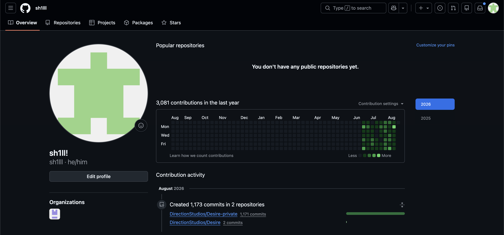

<!-- ╔══════════════════════════════════════════════════════════════════════╗ -->
<!-- ║  DESIRE : README. Banner: .github/assets/banner.svg                   ║ -->
<!-- ╚══════════════════════════════════════════════════════════════════════╝ -->

 

<!-- ── Live stats (auto-update once the repo is public + has releases) ── -->

 

<!-- ── Platform + stack ── -->

&nbsp;

  

### A private, offline-first AI operating layer for your computer.

**One program that can see your screen, run your machine, remember everything you've done, and build the tools it doesn't have yet.**

Most AI assistants live in a browser tab and forget you the moment you close it. Desire lives on your machine, has hands, and remembers.

 

`✦` &nbsp; **Offline by default** &nbsp;·&nbsp; **Local models** &nbsp;·&nbsp; **Online is a setting, not a condition** &nbsp; `✦`

 

## Why it exists

AI assistants are tourists on your computer. They can talk about your files but not open them, describe a workflow but not run it, and they forget you between sessions. Desire closes those gaps.

| | The gap | What Desire does instead |
|:-:|:--|:--|
|  | **No hands** | Runs applications, files, downloads, browsers, and the OS itself, under a permission model you control |
|  | **No eyes** | Sees the screen by default, and can be told to stop, so *"what is this?"* needs no copy-paste |
|  | **No memory** | A local database plus vector index, so you can recall a task from last week from a vague description |
|  | **No privacy** | Runs offline by default. Local models. Online is a switch *you* flip |

> **Genesis.** If Desire doesn't have the tab you need, you ask for it and it *builds one*, in the app's own design language. Desire isn't a fixed set of features. It's a substrate that grows features on request.

 

✦ &nbsp;&nbsp; ✧ &nbsp;&nbsp; ✦

 

## Inside Desire

A desktop application organized as **87 shipped modules**, and it keeps growing. New surfaces land most sessions. A few of the ones worth meeting first:

| Surface | What it is |
|:--|:--|
| **Atlas** | The home dashboard. Tasks, goals, calendar, health, finance, journal, notes, and learning in one place |
| **Mission Control** | Watch the agent work in real time, with its own browser and a rewindable action timeline |
| **Arcane** | The Agent Studio. Build subagents and full agents with their own roles, tools, permissions, and budgets |
| **Sidera** | Encrypted peer-to-peer: chat, calls, screenshare, file transfer, and remote control |
| **Envoy** | Voice command of both the app and the machine |

<b>The full surface list &nbsp;(87 shipped, more each session)</b>

 

Looks · Atlas · Chat · Studio · Dispatch · Helios · Mission Control · Spine · Arcane · Lyceum · Obligations · Follow-Through · Clarity · Decisions · Signal · Wire · Deals · Learning Map · Self-Improvement · Guardian · Vigil · Missions · CODEX Review · Lattice · Query · Privacy · Runtimes · Watch · Bridge · Model Hub · Time Machine · Echo Ambient · Resonance · Lingua · Board · Loadouts · Glyphs · Session Packs · Provenance · Intelligence · Commitments · Genesis · Memory · Chronicle · Vault · Synapse · Inkwell · Terminal · Execution · Directives · Creator · Tool Completer · Constellation · Relay · Lens · ECHO Audio Hub · Echo · Photo Editor · Video Editor · 3D Design · Nocturnum · Finance · Financial Markets · Search · Nova Browser · Orbit · Nexus · Sidera · Conflux · Sigil · MOSAIC · Marketplace · Do It Again · Sync · Velocity · Monitor · Protocols · Tessera · Folio · Crucible · Weave · Press · Trove · Workbench · Envoy · Recall · Undo Ledger

 

✦ &nbsp;&nbsp; ✧ &nbsp;&nbsp; ✦

 

## By the numbers

Last updated 2026-08-22. Refreshed on every push.

| | | | |
|:--|:--|:--|:--|
| **~636k** lines of TypeScript | **~3,540** TS/TSX files (**~12,000** tracked total) | **87** modules shipped | **4** shared packages + **2** apps |
| **3,312** commits since 2026-06-21 | **~58** commits/day | **736**-check verification suite | **8**-stage CI |

 

## Download

Grab the installer for your platform from the [**latest release**](https://github.com/DirectionStudios/Desire/releases/latest):

| Platform | File | |
|---|---|---|
| macOS | `Desire-<version>-arm64.dmg` | Apple Silicon |
| macOS | `Desire-<version>-x64.dmg` | Intel |
| Linux | `Desire-<version>.AppImage` | x64 + arm64 |
| Windows | `Desire-Setup-<version>.exe` | 64-bit, coming soon |

Desire runs offline out of the box. Online features are opt-in, per-feature, from inside the app.

The current build is unsigned. On macOS, right-click the app and choose **Open** on first launch to get past Gatekeeper.

 

## Built with

Electron, React, TypeScript, and Vite, over a local SQLite database with an on-device vector index, so your data and your models stay on your machine.

 

## Roadmap

Desire is early. What's next:

- **Mobile companions.** Pair a phone with the desktop to approve agent actions, watch Mission Control, and hit an emergency stop from your pocket. *Coming soon.*

More lands here as it firms up.

 

## Status

> **Early and moving fast.** macOS and Linux builds are live on the [Releases](https://github.com/DirectionStudios/Desire/releases) page today; Windows is next. Watch this repo to catch new builds as they land.

 

## The Receipts:

- **3,312 commits** since June 21, 2026, roughly **58 commits a day**
- **~636k lines** of TypeScript/TSX application code across **~3,540 `.ts`/`.tsx` files** (~12,000 tracked files total)
- A monorepo of 4 shared packages (`core`, `db`, `protocols`, `ui`) + 2 apps (`desktop`, `server`)

## License

**© 2026 Takshil Pant. All rights reserved.**

Desire is proprietary software, licensed for personal use only. See [`LICENSE`](LICENSE). You may download and run the official builds for your own personal, non-commercial use. You may not redistribute, share, resell, or use Desire commercially, and no rights are granted to any source code. Third-party open-source components remain under their own licenses.

 

<code>✦</code> &nbsp; Built to live on your machine, not in someone's cloud. &nbsp; <code>✦</code>

